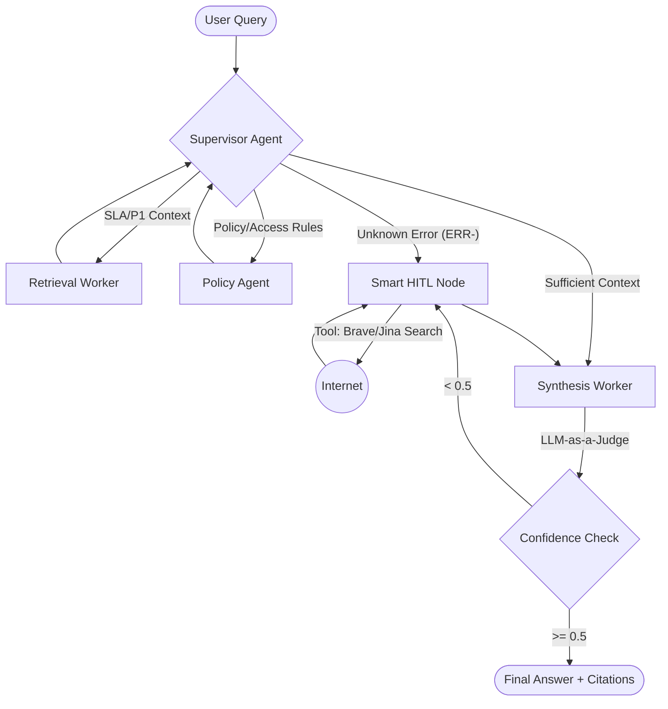

# System Architecture — Lab Day 09: Multi-Agent Orchestration

##  1. Tổng quan kiến trúc
Dự án áp dụng mô hình **Supervisor-Worker**. Thay vì một luồng tuyến tính, hệ thống cho phép Supervisor điều phối tác vụ qua nhiều worker trước khi đưa ra câu trả lời cuối cùng.

## 🗺️ 2. Sơ đồ Pipeline (Mermaid Diagram)

##  3. Chi tiết các thành phần

### Supervisor Agent (`graph.py`)
- **Nhiệm vụ**: Đóng vai trò là "Bộ não" điều phối. Phân tích intent của người dùng thông qua Keyword Heuristics và trạng thái `workers_called` để quyết định bước đi tiếp theo.
- **Routing Logic**: 
    - Ưu tiên 1: Chặn các vi phạm Policy và Access Level.
    - Ưu tiên 2: Truy xuất hồ sơ SLA/P1.
    - Ưu tiên 3: Nếu gặp mã lỗi lạ (`ERR-`), đẩy sang nhánh Research bên ngoài.
- **Multi-hop**: Sau mỗi bước Worker, Supervisor sẽ đánh giá lại Context để quyết định tiếp tục loop hay kết thúc tại Synthesis.

### Workers Chuyên biệt
- **Retrieval Worker**: Sử dụng Hybrid Search (Dense + BM25) kết hợp **Jina Reranker v2** để đảm bảo độ chính xác của các đoạn văn bản trích xuất từ ChromaDB.
- **Policy Agent**: Một Agent tự trị có khả năng gọi các **MCP Tools** (`get_ticket_info`) để kiểm tra dữ liệu thực tế và đối chiếu với luật công ty.
- **Smart HITL (Research)**: Giải quyết vấn đề "Kiến thức ngoài hệ thống" bằng cách tra cứu Internet thời gian thực.

### Synthesis Worker (`workers/synthesis.py`)
- **Vai trò**: Trình bày câu trả lời chuyên nghiệp, ghi chú nguồn rõ ràng.
- **LLM-as-a-Judge**: Tích hợp một quy trình tự đánh giá (Self-correction) để chấm điểm mức độ tin cậy. Nếu điểm Judge dưới 0.5, hệ thống sẽ tự động kích hoạt cờ `hitl_triggered`.

##  4. MCP Tools và Tích hợp
Hệ thống sử dụng MCP Server để đóng gói các khả năng tương tác ngoại vi:
- `search_kb`: Công cụ tìm kiếm ngữ nghĩa nội bộ.
- `get_ticket_info`: Kết nối (mock) tới hệ thống Jira/Helpdesk.
- **Brave Search**: Capability nâng cao giúp Agent "thoát" khỏi giới hạn của Data nội bộ khi cần thiết.

##  5. Ưu điểm của Kiến trúc Multi-Agent
- **Cô lập lỗi (Fault Isolation)**: Lỗi từ Internet không ảnh hưởng đến phân tích Policy nội bộ.
- **Tính minh bạch (Observability)**: Mọi bước đi đều được Trace JSON ghi lại (Worker I/O).
- **Độ tin cậy cao**: Sự kết hợp giữa Looping và Judge giúp giảm thiểu tối đa tình trạng "Hallucination" (Ảo giác AI).
